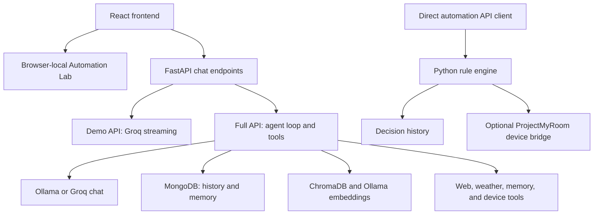

# P2BL

A smart-home assistant with a React chat interface, a rule-based Automation Lab, and a Python API. Explore lighting, energy saving, comfort, and safety scenarios, inspect automation decisions, and chat with an AI assistant.

## Contents

- [Features](#features)
- [Architecture and operating modes](#architecture-and-operating-modes)
- [Repository layout](#repository-layout)
- [Quick start: classroom demo](#quick-start-classroom-demo)
- [Full backend](#full-backend)
- [Configuration reference](#configuration-reference)
- [Voice setup](#voice-setup)
- [Automation and device control](#automation-and-device-control)
- [API reference and examples](#api-reference-and-examples)
- [Validation](#validation)
- [Troubleshooting](#troubleshooting)
- [Configuration and privacy](#configuration-and-privacy)
- [Contributing](#contributing)
- [Credits](#credits)

## Features

- Automation Lab with simulated sensor inputs and explanations of selected actions.
- Rule priorities, resident overrides, stale-observation checks, and occupancy privacy controls.
- Streaming AI chat, conversation history, model selection, and optional voice input/output.
- Full backend with MongoDB persistence, ChromaDB memory, Ollama models, optional Groq chat, and external tools.
- Lightweight Groq demo API for chat without the full database and local-model stack.

## Architecture and operating modes

The chat interface and Automation Lab share the frontend, but use separate execution paths. The current Lab evaluates mock sensor scenarios directly in the browser. It does not call the backend automation endpoints or control real devices.

| Mode | Required services | Available behavior |
| --- | --- | --- |
| Browser simulator | Vite frontend | Mock sensor scenarios, rule toggles, occupancy consent, resident override demonstration, and decision traces |
| Classroom chat demo | Frontend, demo API, Groq key | Streaming chat with Groq; history endpoints return empty lists; voice, persistent memory, and device tools are unavailable |
| Full service | Frontend, full API, MongoDB, Ollama; optional Groq and voice assets | Agent tool calling, chat history, memory, document indexing, voice, and backend automation APIs |



Groq replaces the chat model provider when configured; it does not replace Ollama embeddings used by vector memory. The simulator's named agents are deterministic processing stages, not independent AI models.

## Repository layout

```text
frontend/
  src/App.jsx                    Chat state, streaming, history, and voice
  src/components/AutomationLab.jsx  Browser simulator and rule traces
  src/components/ChatBox.jsx      Input, model commands, and mic controls
  src/components/MessageBubble.jsx  Message and tool-event rendering
  src/lib/handsfree.js            Voice detection and WAV encoding
  src/styles.css                 Interface styles
  package.json                   Development and build commands
backend/
  app/main.py                    Full FastAPI application
  app/config.py                  Environment-based settings
  app/automation_engine.py       Deterministic rule evaluation
  app/automation_service.py      Decision history and optional actuation
  app/agent/                     Agent loop, prompts, and tool registry
  app/db/                        MongoDB and ChromaDB integration
  app/services/                  Model and voice services
  app/tools/                     External and memory tools
  demo_api.py                    Lightweight Groq chat application
  tests/test_automation_engine.py  Existing rule-engine tests
  .env.example                   Configuration template
README.md                        Setup and usage guide
AGENTS.md                        Repository conventions
```

## Quick start: classroom demo

Install Node.js, Python 3.11+, and obtain a Groq API key for AI chat. Run these commands from the repository root in PowerShell:

Start by cloning the repository:

```powershell
git clone https://github.com/goprocker/p2bl.git
cd p2bl
```

Use a current Node.js LTS release with npm. Docker is optional for the classroom demo. The full backend additionally requires MongoDB and Ollama.

```powershell
cd backend
python -m venv .venv
.\.venv\Scripts\Activate.ps1
pip install fastapi uvicorn httpx
Copy-Item .env.example .env
```

Set `GROQ_API_KEY` in `backend/.env`. Never paste the key into frontend code or commit the environment file. Then start the demo API:

```powershell
uvicorn demo_api:app --reload --port 8000
```

In another terminal, start the interface:

```powershell
cd frontend
npm install
$env:VITE_API_URL = 'http://127.0.0.1:8000'
npm run dev
```

Open http://localhost:5173. The Automation Lab runs in the browser; demo AI chat requires the Groq key and sends chat messages to Groq. The demo API does not provide persistent history, memory, voice, or live device control.

**API port:** the frontend's current fallback is `http://127.0.0.1:8001`, while this guide starts the API on port `8000`. The `VITE_API_URL` setting above aligns them. Alternatively, start the API with `--port 8001` and use the frontend default.

To use the simulator without AI chat, start only the frontend, open Automation Lab, select Evening arrival, Away energy, or Unusual entry, and run the scenario. Inspect facts, matched rules, selected/rejected actions, and the processing trace. Disable a rule or occupancy consent and compare the decision.

On macOS/Linux, activate the environment with `source .venv/bin/activate`, copy configuration with `cp .env.example .env`, and start Vite with `VITE_API_URL=http://127.0.0.1:8000 npm run dev`.

## Full backend

From `backend/`, activate the virtual environment, install the complete dependencies, and install Chromium:

If starting directly with the full service, create `.venv` and copy `.env.example` to `.env` using the demo's preparation steps first. Preserve an existing `.env` rather than overwriting it.

```powershell
pip install -r requirements.txt
playwright install chromium
```

Start MongoDB and Ollama. If Docker is installed, MongoDB can be started with:

```powershell
docker run -d --name p2bl-mongo -p 27017:27017 -v p2bl_mongo:/data/db mongo:7
ollama pull qwen3
ollama pull nomic-embed-text
```

Configure `backend/.env`, then run:

```powershell
uvicorn app.main:app --reload --port 8000
```

Use either the demo API or full API on port 8000 at a time. The full backend prefers Groq when `GROQ_API_KEY` is configured; leave it empty to use Ollama for chat. Voice requires Whisper and a configured Piper voice; see [backend setup](backend/README.md).

Health endpoint: http://localhost:8000/health. Interactive API docs: http://localhost:8000/docs.

For a different API address, set `VITE_API_URL` in `frontend/.env` and restart Vite. Vite variables are public; never put API keys there.

For example, `frontend/.env` can contain:

```dotenv
VITE_API_URL=http://127.0.0.1:8000
```

Keep `CORS_ORIGINS` aligned with the browser's actual origin. `http://localhost:5173` and `http://127.0.0.1:5173` are different origins. The full backend defaults allow localhost ports 5173 and 3000; the demo permits both localhost and 127.0.0.1 on port 5173.

## Configuration reference

The full service reads settings from `backend/.env` through `app/config.py`. Run backend commands from `backend/` so relative paths resolve correctly. The demo reads its adjacent `.env` and uses only its Groq settings.

| Variable | Default or template value | Purpose |
| --- | --- | --- |
| `MONGO_URI` | `mongodb://localhost:27017` | MongoDB connection |
| `MONGO_DB` | `local_ai_agent` | Application database |
| `OLLAMA_HOST` | `http://localhost:11434` | Local model server |
| `OLLAMA_MODEL` | `qwen3` | Tool-capable local chat model |
| `OLLAMA_EMBED_MODEL` | `nomic-embed-text` | Vector embeddings |
| `OLLAMA_TEMPERATURE` | `0.3` | Chat sampling temperature |
| `GROQ_API_KEY` | Empty | Enables Groq chat when nonempty |
| `GROQ_MODEL` | `llama-3.3-70b-versatile` in template/full service | Groq model; standalone demo fallback is `openai/gpt-oss-20b` |
| `CHROMA_DIR` | `./chroma_data` | Local vector data directory |
| `OPENWEATHER_API_KEY` | Empty | Optional OpenWeatherMap provider; otherwise weather uses fallback providers |
| `MAX_AGENT_STEPS` | `6` | Maximum agent tool-use iterations |
| `TOOL_TIMEOUT_SECONDS` | `60` | Tool execution timeout |
| `HISTORY_LIMIT` | `12` | Prior messages supplied to the model |
| `CORS_ORIGINS` | `http://localhost:5173,http://localhost:3000` | Full API browser-origin allowlist |
| `LOG_LEVEL` | `INFO` | Logging level |
| `WHISPER_MODEL` | `base` | Local transcription model size |
| `WHISPER_LANGUAGE` | `en` | Transcription language; empty enables detection |
| `TTS_ENGINE` | `auto` | `auto`, `piper`, or macOS `say` |
| `PIPER_VOICE_PATH` | `./voices/en_US-lessac-medium.onnx` in template | Local Piper voice file |
| `SAY_VOICE` | Empty | Optional macOS voice name |
| `MYROOM_API_URL` | `http://localhost:3100` | External device-service address |
| `MYROOM_API_TOKEN` | Empty | Device-service authentication token |
| `AUTOMATION_LIVE_ENABLED` | `false` | Server gate for automation API device execution |
| `VITE_API_URL` | `http://127.0.0.1:8001` frontend fallback | Public API address, configured in frontend environment |

## Voice setup

Voice is available with the full backend. Whisper loads lazily and may download its model on the first transcription request. The frontend requests microphone access for tap-to-talk or hands-free mode; browsers require localhost or a secure HTTPS context for microphone access.

For Piper speech output on Windows/Linux, download both the voice model and matching JSON configuration into `backend/voices/`. From `backend/`:

```powershell
New-Item -ItemType Directory -Force voices
Invoke-WebRequest 'https://huggingface.co/rhasspy/piper-voices/resolve/main/en/en_US/lessac/medium/en_US-lessac-medium.onnx' -OutFile 'voices/en_US-lessac-medium.onnx'
Invoke-WebRequest 'https://huggingface.co/rhasspy/piper-voices/resolve/main/en/en_US/lessac/medium/en_US-lessac-medium.onnx.json' -OutFile 'voices/en_US-lessac-medium.onnx.json'
```

Set `TTS_ENGINE=piper` and `PIPER_VOICE_PATH=./voices/en_US-lessac-medium.onnx` in `.env`. On macOS, `TTS_ENGINE=say` can use the built-in speech engine. Automatic mode falls back to macOS `say` when Piper is unavailable; Windows/Linux therefore need a working Piper configuration for speech output. Voice assets are ignored by Git.

## Automation and device control

Automation starts in dry-run mode. Live execution requires the external ProjectMyRoom API, `MYROOM_API_URL`, `MYROOM_API_TOKEN`, and `AUTOMATION_LIVE_ENABLED=true`, as well as a live execution request. The external device service is not included in this repository.

These gates apply to `/automation/evaluate` device actions. Chat's registered device tool uses the ProjectMyRoom token directly; `AUTOMATION_LIVE_ENABLED` is not a global gate for chat tools. Leave the token empty when device access should be unavailable.

### Implemented policies

| Rule ID | Conditions | Proposed action |
| --- | --- | --- |
| `evening-arrival-light` | Occupied room, light below 100 lux, local hour from 18 through 22 | Turn on `living room light` |
| `away-high-load` | Unoccupied home, away mode, power at least 1000 W, approved standby devices supplied | Turn off only supplied standby devices |
| `unusual-entry` | Door open in away mode without confirmed authorized entry | Record an unexpected-entry alert |

Backend priority order is safety (500), resident (400), accessibility (300), comfort (200), energy (100), default (0). Accessibility/default are priority categories, not additional implemented rules. An active safety action suppresses other actions except resident overrides. For a shared action kind and target, the highest-priority candidate wins.

### Context freshness and resident control

The Python engine expires `away_mode` after 30 minutes, occupancy/light facts after 5 minutes, and other observations after 2 minutes. Expired or null observations are omitted. Setting `occupancy_automation=false` omits occupancy facts, preventing occupancy-dependent policies from matching.

A backend resident command overrides a device for 30 minutes by default; `hold_minutes` accepts 1–1440 minutes. Overrides are held in process memory and do not survive a restart. The browser demo illustrates overrides per evaluation but does not implement the backend's timed persistence or stale-fact filtering.

Backend decisions are saved to MongoDB when available, with an in-memory fallback holding up to 100 recent decisions. Rule states also attempt MongoDB persistence. Notification results are recorded in the decision output; there is no external email, SMS, or push-notification integration.

### Live integration

The bridge reads devices from ProjectMyRoom `/api/listDevice` and sends status changes to `/api/changeDeviceStatus` with an `x-auth-token` header. Confirm the configured service, device names, and intended actions before sending `dry_run=false`. The browser Lab remains a local simulator; use the backend API for this integration.

## API reference and examples

The following routes belong to the full application, `app.main:app`. Open `/docs` for request schemas and interactive examples.

| Method | Route | Purpose |
| --- | --- | --- |
| `GET` | `/health` | Database, model-provider, voice, and automation status |
| `GET` | `/models` | Available chat models and active provider |
| `POST` | `/chat` | Nonstreaming agent response |
| `POST` | `/chat/stream` | Server-sent chat tokens and tool events |
| `GET` | `/conversations` | Conversation list; accepts `user_id` and `limit` |
| `GET` | `/conversations/{conversation_id}/messages` | Reopen conversation messages |
| `POST` | `/voice/chat` | Audio upload, transcription, assistant answer, and speech |
| `POST` | `/voice/speak` | Text-to-speech response |
| `GET` | `/automation/rules` | Rule catalog and enabled states |
| `PATCH` | `/automation/rules/{rule_id}` | Enable or disable a rule |
| `POST` | `/automation/evaluate` | Evaluate context and record proposed/executed actions |
| `GET` | `/automation/decisions` | Decision history; `limit` defaults to 20, maximum 100 |
| `GET` | `/memories` | List user memories |
| `POST` | `/memory` | Save a memory |
| `DELETE` | `/memory/{memory_id}` | Delete a memory |
| `POST` | `/documents` | Upload a text-based file for memory indexing |
| `GET` | `/vectors` | Inspect `memories` or `documents` vector collection |

The demo supports `/health`, `/models`, `/chat/stream`, and empty conversation-list/message endpoints. Do not use it for the full API's other routes.

### Chat example

With the full API running on port 8000:

```powershell
$chat = @{ message = 'Explain the evening arrival lighting rule'; user_id = 'default_user' } | ConvertTo-Json
Invoke-RestMethod -Uri 'http://localhost:8000/chat' -Method Post -ContentType 'application/json' -Body $chat
```

### Dry-run automation example

Omitting `observed_at` uses current server time. Supply `local_hour` explicitly when demonstrating evening conditions outside evening hours.

```powershell
$scenario = @{
    room = 'living_room'
    observations = @{ occupied = $true; light_level_lux = 32; local_hour = 19; away_mode = $false }
    occupancy_automation = $true
    approved_standby_devices = @()
    dry_run = $true
} | ConvertTo-Json -Depth 5
Invoke-RestMethod -Uri 'http://localhost:8000/automation/evaluate' -Method Post -ContentType 'application/json' -Body $scenario
```

Expected decision: `evening-arrival-light` matches, the living-room light receives an `on` action, and execution status is `proposed`. No device command is sent. The response includes facts, matched rules, selected/rejected actions, execution results, trace, decision ID, and duration.

To disable that backend rule:

```powershell
Invoke-RestMethod -Uri 'http://localhost:8000/automation/rules/evening-arrival-light' -Method Patch -ContentType 'application/json' -Body '{"enabled":false}'
```

Re-enable it with `{"enabled":true}`. Backend toggles do not change the browser simulator's local rule state.

## Validation

```powershell
cd frontend
npm run build
cd ../backend
python -m unittest discover -s tests -v
```

The existing five Python tests cover evening lighting, approved energy devices, safety suppression, resident overrides, and stale/private occupancy. They do not verify external model, voice, database, or hardware integration.

For a manual check, inspect `/health` and `/docs`, stream a chat response, cancel a response, reopen history with the full backend, and run all three Lab scenarios. Test microphone permissions and speech separately when voice is configured.

To preview a frontend production build:

```powershell
cd frontend
npm run build
npm run preview
```

Vite embeds `VITE_API_URL` at build time. Rebuild after changing it. If preview uses a different origin, include that origin in the full backend's `CORS_ORIGINS`. Preview alone does not start the API.

## Troubleshooting

| Symptom | Check or action |
| --- | --- |
| Chat cannot reach API | Match `VITE_API_URL` to the running API port; fallback is 8001, examples use 8000. Restart Vite after changing environment settings. |
| Browser reports CORS errors | Add the actual origin to full-service `CORS_ORIGINS`; localhost and 127.0.0.1 differ. Restart the API. |
| Groq reports missing key or authentication failure | Set a valid `GROQ_API_KEY` only in `backend/.env`; restart the API. Verify chosen model availability with Groq. |
| Local model fails or models list is empty | Start Ollama, pull the configured chat model, and verify `OLLAMA_HOST`. |
| Memory/vector operations fail with Groq chat | Start Ollama and pull `nomic-embed-text`; embeddings still use Ollama. |
| History or memory fails | Start MongoDB and check `MONGO_URI`. The demo intentionally returns empty history. |
| Microphone unavailable | Grant browser permission and use localhost or HTTPS. Voice routes require the full API. |
| Speech output fails on Windows/Linux | Install full dependencies and provide Piper `.onnx` plus matching `.json`; macOS `say` is unavailable on these systems. |
| First voice request is slow | Whisper downloads/loads its model on first use; smaller models reduce startup cost. |
| Backend rules produce no action | Check rule enabled state, sensor thresholds, observation timestamps, and occupancy consent. |
| Live action is blocked | Check `dry_run`, server live gate, token, and external device service; browser Lab does not execute live commands. |
| Port already in use | Stop the other API process or choose another port and update frontend configuration. |
| PowerShell blocks virtual-environment activation | Use `.\.venv\Scripts\python.exe -m pip` and `.\.venv\Scripts\python.exe -m uvicorn` without activating. |

## Configuration and privacy

Keep credentials in `backend/.env`. Environment files, dependencies, build output, model assets, logs, and vector data are excluded from Git. Local models support local processing, but Groq and web/weather tools communicate with external services. This development API should run on a trusted local network.

The repository does not implement a production authentication/authorization system. User IDs identify records but are not an access-control boundary. Avoid exposing chat history, memories, document uploads, or device routes publicly without adding authentication and deployment controls. The full service can retain conversation text, saved memories, and document content in MongoDB/ChromaDB; the demo does not persist history through those stores.

## Contributing

Keep changes in the owning layer: UI in `frontend/src/`, rules in `backend/app/automation_engine.py`, orchestration in `backend/app/automation_service.py`, and integrations in `backend/app/tools/`. Register new agent tools in `backend/app/agent/tool_registry.py`.

Use two-space indentation, single quotes, and no semicolons in JavaScript; four-space indentation, snake_case, and type annotations in Python. Run the frontend build and affected Python tests. Include reproduction steps and screenshots for UI changes. Never commit credentials, personal memories, downloaded models, or runtime data.

## Credits

Based on the frontend and backend originally built by [Reegan](https://reeganlabs.com), with P2BL smart-home automation and demo additions.
